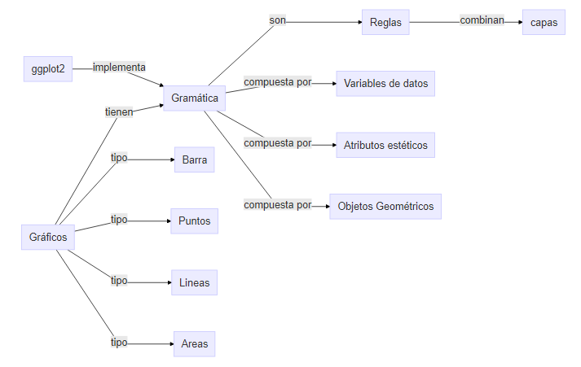

```{r setup, include=FALSE}
library(learnr)
library(DiagrammeR)
library(ggplot2)
library(gapminder)
library(dplyr)

knitr::opts_chunk$set(echo = FALSE)

Argentina <- gapminder %>%
  filter(country == 'Argentina')

```


## Presentación 

```{r, echo=FALSE, out.width="100%", fig.align = "center"}
knitr::include_graphics("images/30DiasDeGraficos2020.png")  
```

### Mapa conceptual

Estos son los conceptos y relaciones que vamos a cubrir durante el tutorial:

```{r echo=FALSE}
DiagrammeR("
graph LR;
  A[Gráficos] -->|tienen| B[Gramática];
  A -->|tipo| C[Barra];
  A -->|tipo| D[Puntos];
  A -->|tipo| E[Lineas];
  A -->|tipo| L[Areas];
  B -->|son| F[Reglas];
  B -->|compuesta por| G[Variables de datos];
  B -->|compuesta por| H[Atributos estéticos];
  B -->|compuesta por| I[Objetos Geométricos];
  F -->|combinan| J[capas]
  K[ggplot2] -->|implementa| B
")

#   

```

### ¿Quién sos vos?

En este tutorial vamos a repasar como generar una serie de gráficos básicos con R utilizando el paquete `ggplot2`.  Cuando generamos este tutorial pensamos en las siguientes personas:

```{r, echo=FALSE, out.width="100%", fig.align = "center"}
  
```
> [Photo by Brooke Cagle on Unsplash](https://unsplash.com/photos/C-v1p2DTakA)


**Felicitas** está dando sus primeros pasos como investigadora. Debe hacer informes que incluyan estadísticas como parte de sus actividades. Usa Excel e InfoStat (un programa de estadísticas basado en menús) para registrar sus datos y realizar sus cálculos; y luego usa Word para escribir sus informes copiando y pegando desde los otros softwares. Ha visto gráficos e informes PDF generados en R por sus compañeras de trabajo. La estética de los gráficos y la posibilidad de automatizar algunos de sus informes hizo que se interese en aprender a usar R. No tiene mucho tiempo para ir a cursos formales, ya se instaló R y RStudio y quiere empezar a aprender por su cuenta hasta que pueda asisitir a algun meetup de R-Ladies en su ciudad, donde sus compañeras aprendieron a utilizar estas herramientas.

**Sebastián** es un entusiasta del análisis de datos, está cursando el último año de su carrera de grado en economía y aunque en su disciplina se usan otros software, ha escuchado mucho sobre R ultimamente y ve que hay una gran movida comunitaria en la región especialmente en twitter.  Descubrió que hay desafíos semanales para aprender diferentes herramientas y justo este mes se hace uno de 30 días de gráficos.  Le parece una gran oportunidad para aprender, pero no sabe muy bien por donde empezar a aprender como graficar con R porque cuando busca en Internet aparecen códigos muy diferentes para el mismo tipo de gráfico.


### Licencia

```{r, echo=FALSE, fig.align = "left"}
  
```

Este curso se comparte bajo la licencia [Creative Commons Attribution-ShareAlike 4.0 International License](https://creativecommons.org/licenses/by-sa/4.0/deed.es_ES) y fue realizado por [Yanina Bellini Saibene](https://yabellini.netlify.app/)


## Introducción

Vamos a utilizar el paquete `ggplot2` que implementa la _gramática de los gráficos_ desarrollada por Leland Wilkinson.  Esta gramática define un _conjunto de reglas_ para construir _gráficos estadísticos combinando_ diferentes tipos de _capas_.

La gramática nos dice que:

> Un gráfico es un *mapeo* de variables de *datos* a atributos *estéticos* de objetos *geométricos*. 

Específicamente, podemos *dividir un gráfico* en los siguientes *tres componentes esenciales*:

1. *Datos (_data_*, en inglés): el conjunto de datos compuesto por variables que mapeamos.

2. *Geometría (_geom_*, por _geometry_ en inglés): el objeto geométrico en cuestión. Se refiere al tipo de objeto que compone el gráfico, por ejemplo: puntos, líneas y barras.

3. *Estética (aes*, por _aesthetic_ en inglés): atributos estéticos del objeto geométrico. Por ejemplo, posición x,  y, color, forma y tamaño. Cada atributo estético se puede asignar a una variable en nuestro conjunto de datos.

### Ejemplo de la gramática en un gráfico

Vamos a ver un ejemplo de estos componentes en un gráfico, para ello vamos a utilizar el paquete `gapminder` que ya instalamos y cargamos por ti.

Para ver los datos de `gapminder`, escribe `gapminder` en el bloque de código que aparece abajo y luego haz click en el botón _"Ejecutar código"_.

```{r gapminder0, exercise = TRUE}


```

```{r gapminder0-solution}
gapminder
```

### Mensaje

Buen trabajo! Usaremos fragmentos de código interactivos como este en el tutorial. Siempre que encuentres uno, puedes hacer clic en _Ejecutar código_ para ejecutar el código escrito. Si hay un botón _Pista_ o _Solución_, puedes hacer clic para recibir ayuda y/o ver la respuesta.

## A graficar

### Veamos un gráfico a través de la gramática de los gráficos.

El siguiente gráfico está realizado con los datos de `gapminder`, intentemos reconocer que variables y secciones corresponden a la gramática de gráficos:

```{r echo=TRUE}

ggplot(data = gapminder, 
       mapping = aes(x = gdpPercap, y = lifeExp, color = continent, size = pop)) +
    geom_point()

```

Mirando el código y el gráfico, podemos indentificar que:

* Datos: el *nombre del conjunto de datos* (gapminder) se asigna al atributo `data`
* Estética: el eje `x` representa la variable `gdpPercap`, el eje `y` representa la variable `lifeExp`, el `color` (o `colour`) representa la variable `continent` y el tamaño (`size`) representa la variable población.
* Geometría: generamos un gráfico de puntos, como indica la función `geom_point()`


### Cambiemos algunas propiedades

Supongamos que queremos cambiar los ejes del gráfico, ¿cómo cambiarías el código anterior para lograr ese cambio?

```{r grafico_puntos, exercise=TRUE}

ggplot(data = gapminder, 
       mapping = aes(x = gdpPercap, y = lifeExp, color = continent, size = pop))+
    geom_point()

```

```{r grafico_puntos-hint}

Recuerda que los ejes están representados por las letras x (horizontal) e y (vertical)

```

### Mensaje

Bien hecho!, además del gráfico de puntos, indicado en el código anterior por `geom_point()`, tenemos otros tipos de gráficos, por ejemplo gráficos de líneas, de barras, de áreas o histogramas.  


```{r quiz}
quiz(
  question("¿Cómo te parece que pueden llamarse las geometrías para los gráficos de lineas y de áreas?", 
           correct = "Buen trabajo!, la palabra line siginifica linea en inglés y area significa área.", 
           allow_retry = TRUE,
           submit_button = "Enviar respuesta",
           try_again_button = "Volver a intentar",
    answer("geom_line() y geom_bar()", message = "En general a la palabra geom_ se le agrega el nombre de la geometría en Inglés"),
    answer("geom_linea(), geom_sup()", message = "En general a la palabra geom_ se le agrega el nombre de la geometría en Inglés"),
    answer("geom_area(), geom_histogram()", message = "En general a la palabra geom_ se le agrega el nombre de la geometría en Inglés"),
    answer("geom_line(), geom_area()", correct = TRUE)
  ), 
  caption = "Gemetrías con ggplot2"
)
```

### Hagamos un gráfico de lineas

Vamos a realizar otros gráficos utilizando los datos en `gapminder`.  Para generar el gráfico de lineas, vamos a ver la evolución de la población de Argentina en la serie de datos disponible.

Ya hemos filtrado los datos necesarios en el dataset `Argentina` y está disponible en el entorno para que lo puedas utilizar. A continuación te mostramos los primeros registros de este dataset. 

```{r echo=FALSE}
head(Argentina)
```


Modifica el siguiente código para generar un gráfico que lineas que nos muestre los años en el eje x y la población en el eje y.

```{r grafico_lineas, exercise=TRUE}

ggplot(data = ________, 
       mapping = aes(x = _______, y = ________)) +
    geom_line()


```

```{r grafico_lineas-hint}
- El dataset se llama Argentina
- La variable que contiene los años se llama year
- La variable que contiene la población se llama pop

```


```{r grafico_lineas-solution}

ggplot(data = Argentina, 
       mapping = aes(x = year, y = pop)) +
    geom_line()

```

### Hagamos un gráfico de barras

Hay dos formas de hacer un gráfico de barras en `ggplot2`, una forma es utilizando `geom_bar()` y otra es utilizando `geom_col()`.


* `geom_bar()` : utilizamos esta geometría cuando *no tenemos* una variable que contenga el cálculo de la cantidad o frecuencia de la variable categórica que queremos gráficar.  El cálculo se realizará para generar el gráfico.

* `geom_col()` : utilizamos esta geometría cuando *tenemos* en nuestro set de datos una variable con el cálculo de la cantidad o frecuencia de la variable categórica que queremos graficar, con la estética *del eje y* asignada a *la variable que tiene esa cantidad*.

Vamos a transformar el gráfico anterior a barras.  ¿Cómo realizarias este cambio?, ¿cuál de las dos opciones de geometrías utilizarías?

Modifica el siguiente código para generar un gráfico de barras que nos muestre los años en el eje x y la población en el eje y.

```{r grafico_barras, exercise=TRUE}

ggplot(data = Argentina, 
       mapping = aes(x = year, y = pop)) +
    geom_______()


```

```{r grafico_barras-hint}

La variable pop ya contiene la cantidad de la población calculada
```


```{r grafico_barras-solution}

ggplot(data = Argentina, 
       mapping = aes(x = year, y = pop)) +
    geom_col()

```

### Mensaje

Bien hecho!, utilizamos `geom_col()` porque ya contamos con una variable que tiene calculada la cantidad que queremos representar.

### Hagamos un gráfico de área

Vamos a transformar el gráfico anterior a áreas.

Modifica el siguiente código para generar un gráfico de áreas que nos muestre los años en el eje x y la población en el eje y.

```{r grafico_areas, exercise=TRUE}

ggplot(data = Argentina, 
       mapping = aes(x = year, y = pop)) +
    geom_______()


```

```{r grafico_areas-hint}

Recuerda que el nombre de la geometría es la palabra en inglés, en linea es geom_line(), en barras es geom_bar(), para área es geom_ ...
```


```{r grafico_areas-solution}

ggplot(data = Argentina, 
       mapping = aes(x = year, y = pop)) +
    geom_area()

```


## Fuentes

Esperamos que esta pequeña introducción a los gráficos en R te sea de utilidad.  A continuación te dejamos una serie de materiales que pueden resultar muy útiles para continuar aprendiendo y en los cuales basamos este tutorial.

-  [Guía rápida en Español de ggplot2](https://github.com/rstudio/cheatsheets/raw/master/translations/spanish/ggplot2.pdf)

- [RStudio primers en visualización de datos (en Inglés)](https://rstudio.cloud/learn/primers)

- [Capítulo de Visualización de A ModernDive into R and the tidyverse. Chester Ismay and Albert Y. Kim, Foreword by Kelly S. McConville. November 25, 2019 (en Inglés)](https://moderndive.com/2-viz.html)

- [The R Graph Gallery](https://www.r-graph-gallery.com/)

